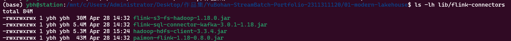
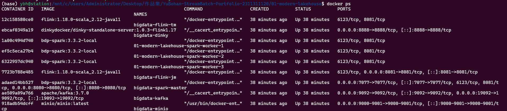
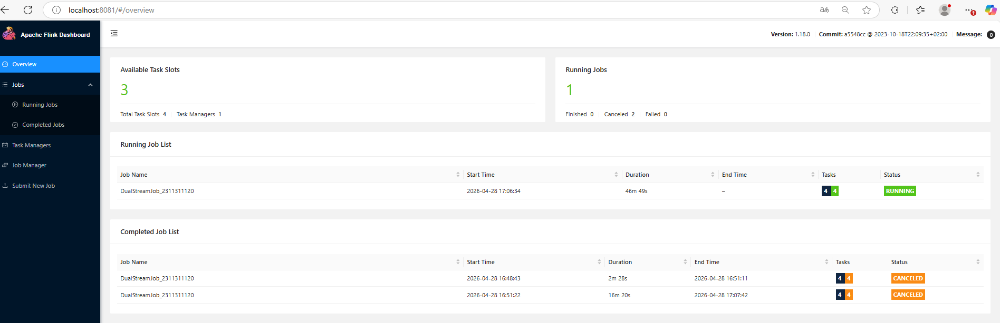
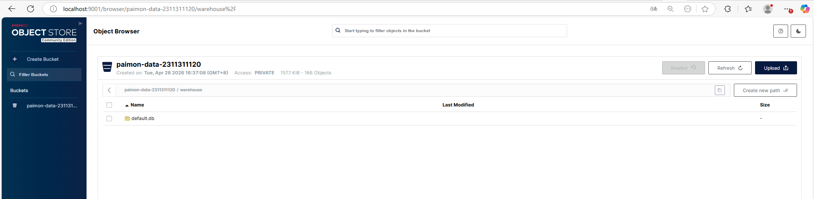
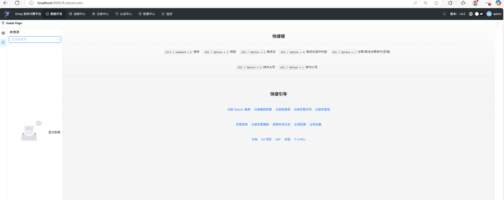
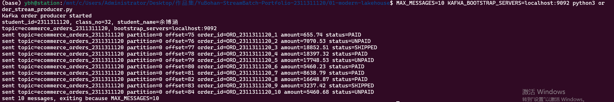
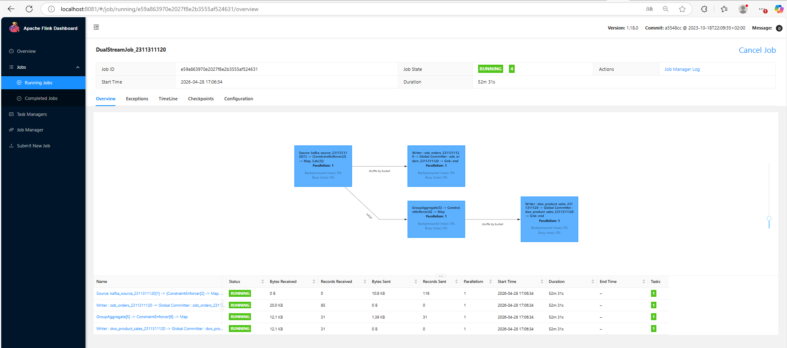
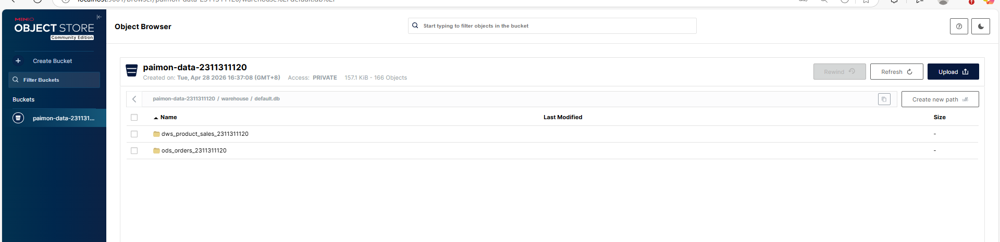
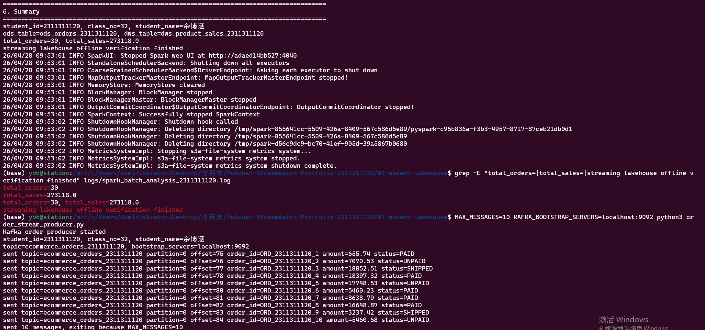

# 现代流批一体数据湖综合实验报告

## 一、个人信息

- 姓名：REDACTED
- 学号：REDACTED
- 班级序号：REDACTED
- 实验方案：方案 B，Dev Containers 云原生隔离模式

本实验所有关键命名均已嵌入学号 `demo000000`，用于满足实验验收的原创性标识要求。

| 对象 | 实验命名 |
|---|---|
| Kafka Topic | `ecommerce_orders_demo000000` |
| MinIO Bucket | `paimon-data-demo000000` |
| Paimon Catalog | `paimon_catalog_demo000000` |
| ODS 表 | `ods_orders_demo000000` |
| DWS 表 | `dws_product_sales_demo000000` |
| 订单 ID 前缀 | `ORD_demo000000_` |
| Flink 作业名 | `DualStreamJob_demo000000` |

## 二、实验环境准备

本实验采用 Dev Containers 云原生隔离模式。本机只需要安装 Docker Desktop、VS Code 与 Dev Containers 插件，Java 11、Maven、Python 等开发依赖均由 `.devcontainer/devcontainer.json` 提供，避免本机 JDK 版本、Maven 配置和依赖冲突造成环境报错。

Dev Container 中预置：

- Java 11：匹配 Flink 1.18 运行环境，避免 JDK 17 强封装导致的反射异常。
- Maven：用于构建 `flink-java-project`。
- Python 3.11：用于运行 Kafka 模拟订单生产者。
- Docker outside of Docker：允许在 Dev Container 中调用宿主机 Docker Desktop。

### 2.1 核心 JAR 准备

`flink-jars` 文件夹中已准备 3 个核心依赖：

| JAR | 作用 |
|---|---|
| `flink-sql-connector-kafka-3.0.1-1.18.jar` | 让 Flink SQL 可以读取 Kafka Topic 中的订单流数据。 |
| `paimon-flink-1.18-0.8.0.jar` | 让 Flink 可以创建和写入 Apache Paimon 数据湖表。 |
| `flink-s3-fs-hadoop-1.18.0.jar` | 让 Flink 可以通过 S3 协议访问 MinIO 对象存储。 |

这些 JAR 需要挂载到 Flink JobManager、TaskManager 和 Dinky 容器中，因为容器内部默认并不包含 Kafka Connector、Paimon Connector 和 S3 文件系统实现。如果不挂载，Flink SQL 会出现找不到 connector 或无法访问 `s3://` 路径的问题。

实验运行过程中额外加入了 `hadoop-hdfs-client-3.3.4.jar` 作为兼容性补充，用于提供 `org.apache.hadoop.hdfs.HdfsConfiguration`，避免 Paimon 创建 S3 Catalog 时缺少 Hadoop HDFS client 类。

截图 1：`flink-jars` 文件夹内容。



## 三、Docker Compose 集群启动

实验使用 `compose.yaml` 启动完整流批一体环境：

| 容器 | 作用 |
|---|---|
| `bigdata-kafka` | 实时消息队列，使用 KRaft 模式，不依赖 Zookeeper。 |
| `bigdata-minio` | S3 兼容对象存储，作为数据湖物理存储底座。 |
| `bigdata-minio-init` | 自动创建 `paimon-data-demo000000` Bucket。 |
| `bigdata-flink-jm` | Flink JobManager，负责作业调度和资源协调。 |
| `bigdata-flink-tm` | Flink TaskManager，负责实际执行计算任务。 |
| `bigdata-dinky` | 一站式 Flink SQL Web 开发平台。 |
| `bigdata-spark-master` | Spark 独立集群 Master，负责任务调度。 |
| `spark-worker` | Spark Worker，负责分布式批处理计算。 |

启动命令：

```bash
docker compose up -d --scale spark-worker=3
```

说明：当前 WSL2 环境中 Docker Hub 对 `apache/spark:3.3.2` 拉取不稳定，因此本实验使用 `spark-local-image/Dockerfile` 基于已可用的 Java 11 镜像构建了本地 Spark 3.3.2 镜像 `bdp-spark:3.3.2-local`。Spark 发行包来自 Apache 镜像站，运行模式仍为 Docker Compose 下的 Spark Standalone 集群。

状态检查命令：

```bash
docker compose ps
docker ps
```

`bigdata-network-demo000000` 是本实验的自定义 Docker 网络。Kafka、Flink、Dinky、MinIO、Spark 等容器在该网络中可以直接通过服务名互相访问，例如 `kafka:29092`、`minio:9000`、`jobmanager:8081`。

Kafka 使用 KRaft 模式，即 Kafka 自身同时承担 Broker 和 Controller 角色，不再依赖传统 Zookeeper。单机实验下，KRaft 部署更轻量，组件更少，启动和排障更简单。

截图 2：`docker ps` 容器状态。



## 四、Web UI 访问验证

| 平台 | 地址 | 说明 |
|---|---|---|
| Flink Web UI | `http://localhost:8081` | 查看 JobManager、TaskManager、运行作业和 Checkpoint。 |
| MinIO Console | `http://localhost:9001` | 查看 Bucket、Paimon 表目录和数据文件。 |
| Dinky Web UI | `http://localhost:8888` | 提交和管理 Flink SQL 作业。 |
| Spark Master UI | `http://localhost:8080` | 查看 Spark Worker 和离线分析任务状态。 |

Flink 中 JobManager 类似调度中心，负责接收作业、生成执行图并分配任务；TaskManager 类似执行节点，负责运行具体算子。MinIO 在本实验中承担数据湖存储层，使用低成本、可扩展的对象存储保存 Paimon 表文件。Dinky 提供可视化 Flink SQL 开发能力，适合快速提交 SQL 作业。Spark 独立集群中 Master 负责资源调度，Worker 提供实际计算资源。

截图 3：Flink Web UI 首页。



截图 4：MinIO Web Console 首页。



截图 5：Dinky Web UI 首页。



## 五、Kafka 实时数据生产

订单生产脚本为 `mock_data_producer.py`，核心配置如下：

- `bootstrap_servers`：连接 Kafka 的地址。宿主机运行时使用 `localhost:9092`；Dev Container 运行时使用 `host.docker.internal:19092`；容器内部服务互联使用 `kafka:29092`。
- `value_serializer`：将 Python 字典序列化为 UTF-8 JSON 字节流。
- `key_serializer`：使用订单 ID 作为 Kafka 消息 Key。
- Topic：`ecommerce_orders_demo000000`。

订单字段说明：

| 字段 | 含义 |
|---|---|
| `order_id` | 订单唯一编号，格式为 `ORD_demo000000_序号`。 |
| `product_name` | 商品名称。 |
| `amount` | 订单金额。 |
| `status` | 订单状态，包括 `UNPAID`、`PAID`、`SHIPPED`。 |
| `create_time` | 订单产生时间。 |

Kafka 在流式架构中承担解耦、削峰、缓冲和异步传输的作用。业务系统只需要把订单写入 Kafka，后续 Flink 等计算系统可以独立消费并进行实时处理。

运行命令：

```bash
python mock_data_producer.py
```

截图 6：Python 生产者控制台输出，需显示 `ecommerce_orders_demo000000` 和 `ORD_demo000000_`。



## 六、Flink 流式入湖

本实验提供两种方式提交 Flink 作业：

- Java 工程方式：`flink-java-project/src/main/java/com/edu/bigdata/FlinkDualStream.java`
- Dinky SQL 方式：`dinky_flink_sql_demo000000.sql`

Flink 作业 `DualStreamJob_demo000000` 完成以下任务：

1. 从 Kafka Topic `ecommerce_orders_demo000000` 读取订单流。
2. 创建 Paimon Catalog `paimon_catalog_demo000000`。
3. 以 `s3://paimon-data-demo000000/warehouse` 作为数据湖仓库路径。
4. 写入 ODS 明细表 `ods_orders_demo000000`。
5. 按 `product_name` 聚合 `PAID` 订单金额，写入 DWS 汇总表 `dws_product_sales_demo000000`。

Flink Checkpoint 每 10 秒触发一次。Checkpoint 会周期性保存流式作业状态，并配合 Paimon 的事务提交机制保证数据写入的一致性。如果作业失败重启，Flink 可以从最近一次成功 Checkpoint 恢复，减少重复写入和数据丢失风险。

ODS 表用于保存原始订单明细，保留订单 ID、商品、金额、状态、创建时间等业务字段；DWS 表用于保存面向分析的产品销售额聚合结果，直接服务后续查询和报表。

Paimon Catalog 关键参数：

| 参数 | 说明 |
|---|---|
| `type=paimon` | 声明 Catalog 类型为 Paimon。 |
| `warehouse=s3://paimon-data-demo000000/warehouse` | 指定数据湖仓库路径。 |
| `s3.endpoint` | 指定 MinIO S3 API 地址。 |
| `s3.access-key` / `s3.secret-key` | 指定 MinIO 访问凭据。 |
| `s3.path.style.access=true` | 兼容 MinIO 的路径风格访问方式。 |

流批一体架构的优势在于同一份 Paimon 数据既可以被 Flink 实时写入，也可以被 Spark 离线读取，避免实时链路和离线链路各维护一份数据造成口径不一致。

截图 7：Flink 任务运行详情，需显示 `DualStreamJob_demo000000`、运行状态和 Checkpoint。



## 七、MinIO 数据湖验证

MinIO 中需要看到 Bucket `paimon-data-demo000000`，其 `warehouse` 目录下包含：

- `ods_orders_demo000000`
- `dws_product_sales_demo000000`

Paimon 表目录通常包含 schema 文件、manifest 文件、snapshot 文件和 data 文件。schema 描述表结构，snapshot 记录表版本，manifest 组织数据文件元信息，data 文件保存实际业务数据。这种结构让数据湖既能保存明细数据，又能支持增量读写、版本管理和批流统一访问。

选择对象存储作为数据湖底座，是因为对象存储具备低成本、高扩展、计算存储分离、易于多引擎共享等特点。相比传统数仓，数据湖可以保存更多类型和粒度的数据，适合实时、离线、机器学习等多种场景统一读取。

截图 8：MinIO Paimon 数据目录，需显示 `paimon-data-demo000000` 和带学号的表名。



## 八、Spark 离线查询验证

Spark 离线分析脚本为 `spark_offline_analysis.py`。它读取同一份 Paimon 数据，完成：

- 展示 Catalog、数据库和表。
- 查询 ODS 订单总数和订单状态分布。
- 查询 DWS 商品销售额。
- 使用 Spark 离线重新聚合 `PAID` 订单。
- 对比 Spark 离线聚合结果与 Flink 实时聚合结果。
- 检查空值和重复订单。

运行命令：

```bash
docker exec -it bigdata-spark-master /opt/spark/bin/spark-submit \
  --master spark://spark-master:7077 \
  --packages org.apache.paimon:paimon-spark-3.3:0.8.0,org.apache.hadoop:hadoop-aws:3.3.2,com.amazonaws:aws-java-sdk-bundle:1.12.367 \
  /opt/spark-apps/spark_offline_analysis.py
```

Spark 与 Paimon 集成的关键在于配置 `SparkCatalog`、仓库路径、MinIO S3 连接参数和 Paimon Spark 扩展。流批一体在查询层面的体现是：Flink 写入的实时数据不需要再次同步到离线系统，Spark 可以直接读取同一份表并做批处理分析。

实时流处理适合订单监控、实时销售额、风控告警等低延迟场景；离线批处理适合日报、月报、历史复盘、复杂多表分析等吞吐优先场景。本实验通过同一份 Paimon 表同时支持这两类计算。

截图 9：Spark 查询结果，可选加分。



## 九、验收命令汇总

```bash
docker compose up -d --scale spark-worker=3
docker compose ps
docker ps
python mock_data_producer.py
docker exec -it bigdata-kafka /opt/kafka/bin/kafka-topics.sh --list --bootstrap-server localhost:9092
docker exec -it bigdata-kafka /opt/kafka/bin/kafka-console-consumer.sh --topic ecommerce_orders_demo000000 --from-beginning --bootstrap-server localhost:9092
docker exec -it bigdata-spark-master /opt/spark/bin/spark-submit --master spark://spark-master:7077 /opt/spark-apps/spark_offline_analysis.py
```

## 十、故障排查记录

1. 如果 Kafka 无法连接，先确认 `docker compose ps` 中 Kafka 正常运行，再区分访问入口：宿主机用 `localhost:9092`，Dev Container 用 `host.docker.internal:19092`，容器内部用 `kafka:29092`。
2. 如果 Flink 提示找不到 Kafka、Paimon 或 S3 Connector，检查 `flink-jars` 中 3 个 JAR 是否存在，并确认 Compose 中已逐个挂载到 `/opt/flink/lib`。
3. 如果 MinIO 中没有数据，检查 Flink 作业是否处于 `RUNNING`，Checkpoint 是否成功，以及 Bucket `paimon-data-demo000000` 是否已创建。
4. 如果 Spark 读取失败，检查 `spark_offline_analysis.py` 中的 Catalog、Bucket、S3 Endpoint 是否与 Flink 写入配置一致。

## 十一、实验完成检查清单

- [ ] `flink-jars` 包含 3 个核心 JAR。
- [ ] Docker Compose 集群全部正常运行。
- [ ] Web UI 均可访问：Flink、MinIO、Dinky、Spark。
- [ ] Kafka Topic `ecommerce_orders_demo000000` 持续接收订单。
- [ ] Python 输出中可见 `ORD_demo000000_` 订单 ID。
- [ ] Flink 作业 `DualStreamJob_demo000000` 正常运行。
- [ ] MinIO 中存在 `paimon-data-demo000000` Bucket。
- [ ] Paimon 表 `ods_orders_demo000000` 和 `dws_product_sales_demo000000` 已写入数据。
- [ ] Spark 能读取 Paimon 表并验证流批结果一致。
